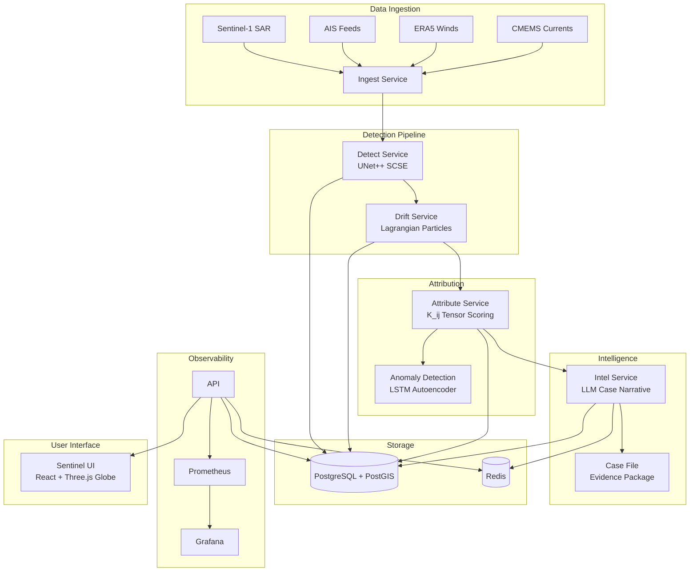

# SENTINEL

**Autonomous Maritime Oil Spill Intelligence Platform**

SENTINEL is an end-to-end system for detecting, attributing, and investigating maritime oil spills using SAR satellite imagery, AIS vessel tracking, ocean drift modeling, and LLM-generated case narratives.

> **New here? Read [`HANDOVER.md`](HANDOVER.md) first.** This README explains how to
> run the system; the handover states what is actually verified, what is only
> assumed, and which performance number to quote.

## Architecture



## Prerequisites

- **Docker** >= 24.0
- **Docker Compose** >= 2.20
- **NVIDIA Container Toolkit** (for GPU inference, optional)
  - Required only for ML model inference in `sentinel-detect`
  - Install: https://docs.nvidia.com/datacenter/cloud-native/container-toolkit/install-guide.html
- **Make** (optional, for convenience targets)

## Quickstart

```bash
# 1. Clone and configure
cp .env.example .env
# Edit .env with your API keys (or leave defaults for demo)

# 2. Start all services
make dev
# or: docker compose -f docker-compose.txt -f docker-compose.override.yml up --build

# 3. Seed the demo case (MV Wakashio, Mauritius 2020)
docker compose exec sentinel-api python scripts/seed_demo_case.py

# 4. Seed additional AIS data (optional)
docker compose exec sentinel-api python scripts/seed_ais_demo.py

# 5. Open the UI
open http://localhost:3000

# 6. Open Grafana dashboards
open http://localhost:3001
```

## Services

| Service | Port | Description |
|---------|------|-------------|
| `sentinel-api` | 8000 | REST API + WebSocket gateway |
| `sentinel-ingest` | 8001 | SAR/AIS/ocean data ingestion |
| `sentinel-detect` | 8002 | UNet++ oil spill segmentation |
| `sentinel-drift` | 8003 | Lagrangian particle drift modeling |
| `sentinel-attribute` | 8004 | Vessel attribution (K_ij tensor) |
| `sentinel-intel` | 8005 | LLM case narrative generation |
| `sentinel-ui` | 3000 | React frontend with 3D globe |
| `sentinel-worker` | - | Celery async task worker |
| `sentinel-db` | 5432 | PostgreSQL 15 + PostGIS 3.4 |
| `sentinel-redis` | 6379 | Redis 7 (message broker) |
| `prometheus` | 9090 | Metrics collection |
| `grafana` | 3001 | Dashboards & alerting |

## API Documentation

### Spill Detection

```bash
# Submit a new SAR image for detection
curl -X POST http://localhost:8000/api/v1/spills/detect \
  -H "Content-Type: application/json" \
  -d '{"image_path": "/data/sar/s1a_image.tif"}'

# Get all spill detections
curl http://localhost:8000/api/v1/spills

# Get a specific spill
curl http://localhost:8000/api/v1/spills/{spill_id}
```

### Drift Analysis

```bash
# Run backward drift for a spill
curl -X POST http://localhost:8000/api/v1/drift/compute \
  -H "Content-Type: application/json" \
  -d '{"spill_id": "...", "particle_count": 1000, "forecast_hours": 72}'

# Get drift results
curl http://localhost:8000/api/v1/drift/{spill_id}
```

### Vessel Attribution

```bash
# Run attribution for a spill
curl -X POST http://localhost:8000/api/v1/attribute/score \
  -H "Content-Type: application/json" \
  -d '{"spill_id": "...", "search_radius_nm": 50, "time_window_hours": 6}'

# Get suspect vessels
curl http://localhost:8000/api/v1/cases/{case_id}/suspects
```

### Investigation Cases

```bash
# Get all cases
curl http://localhost:8000/api/v1/cases

# Get case details with narrative
curl http://localhost:8000/api/v1/cases/{case_id}

# Generate case narrative (triggers LLM)
curl -X POST http://localhost:8000/api/v1/cases/{case_id}/narrative
```

### Health Check

```bash
curl http://localhost:8000/health
```

## Development

```bash
# Run tests
make test

# Lint + format
make lint
make format

# Type check
make typecheck

# Seed demo data
make seed

# Clean everything
make clean
```

### ML Training

The Zenodo Sentinel-1 archive is real and usable, but it is not a small
download: Part I is 40.7 GB of oil images, Part II is 45.9 GB of look-alike
and no-oil images, and Part III is 9.9 GB of test data. The archives are
monolithic `.7z` files, so there is no safe HTTP-only way to download a few
images from Part I. Use the guarded metadata/checksum workflow first:

```bash
python scripts/download_zenodo_dataset.py --list
python scripts/download_zenodo_dataset.py --record part3 --download --extract
```

Part III is for evaluation, not training. For a laptop-sized training run,
combine a prepared subset of real labelled data with the smaller CSIRO/SOS
datasets, or train on a cloud GPU after downloading Part I/II. The trainer
now fails if the requested directory is empty; it never creates synthetic
training samples implicitly.

The trainer reads whichever dataset the data-source switch points at. The real
archive is read **in place** from the external disk — nothing is copied to the
local machine, and the run fails if the source directory changed while it ran.

```bash
# Train the oil spill detector (UNet++) on the real archive, read in place.
# --max-pairs/--max-steps bound a laptop-sized run.
python scripts/train.py --data-source real \
  --epochs 3 --max-pairs 24 --max-steps-per-epoch 1

# Train on the matched synthetic set (no external disk required)
python scripts/train.py --data-source synthetic --epochs 10

# Resume an interrupted run
python scripts/train.py --data-source real --resume checkpoints/<run_id>/detector_last.pth

# Train the anomaly detector (LSTM autoencoder)
python ml/training/train_anomaly.py \
  --data-dir ./data/ais_normal \
  --epochs 50 \
  --seq-len 48

# Download model weights
bash scripts/download_model_weights.sh
```

Every run writes `runs/<run_id>/run_report.json` (config, provenance, source
fingerprint, normalization statistics, augmentation chain, per-epoch metrics)
and `runs/<run_id>/metrics.jsonl`. Checkpoints are written atomically, so an
interrupted run never leaves a half-written file for `--resume` to load.

## Demo Walkthrough: MV Wakashio

The seeded demo case reconstructs the **MV Wakashio grounding and oil spill** off Mauritius on 25 July 2020.

### What Happened

1. **Detection**: Sentinel-1A SAR imagery at 10:30 UTC revealed a 27 km² oil slick at 20.4°S, 57.7°E
2. **Drift Analysis**: Lagrangian particles traced the slick origin to a 95% confidence ellipse centered 12 hours before acquisition
3. **Attribution**: AIS analysis identified 5 vessels; MV Wakashio (MMSI 477218700) scored 91.4% composite confidence
4. **Anomaly**: A 23-minute AIS gap at 10:17-10:40 UTC aligned precisely with the projected origin
5. **Case File**: LLM generated a complete investigation narrative for IMO MEPC referral

### Key Metrics

| Metric | Value |
|--------|-------|
| Spill area | 27.0 km² |
| Detection confidence | 94% |
| Origin uncertainty | ±18 minutes |
| Primary suspect | MV WAKASHIO (91.4%) |
| AIS gap | 23 minutes |
| Distance from spill | 0.8 NM |
| K_ij tensor trace | 0.34 m²/s |

## Technical Details

### K_ij Attribution Tensor

The composite attribution score `K_ij` for vessel `j` at spill `i` is computed as:

```
K_ij = w₁·S_prox + w₂·S_temp + w₃·S_traj + w₄·S_anom + w₅·S_type
```

Where:
- `S_prox`: Spatial proximity score (distance to origin ellipse)
- `S_temp`: Temporal alignment (presence during release window)
- `S_traj`: Trajectory match (course/heading vs. slick orientation)
- `S_anom`: Behavioral anomaly (AIS gaps, speed deviations)
- `S_type`: Vessel-type risk factor

### Fuzzy Scoring

All scores use fuzzy membership functions to handle uncertainty:
- **Proximity**: Gaussian kernel centered on origin ellipse boundary
- **Temporal**: Triangular membership over ±σ of origin time estimate
- **Trajectory**: Cosine similarity between vessel heading and slick orientation
- **Anomaly**: LSTM autoencoder reconstruction error threshold

### Lookalike Filtering

Natural phenomena (algal blooms, sun glint, internal waves) are filtered using:
- GLCM texture features (contrast, homogeneity)
- Shape metrics (compactness, elongation)
- Wind speed threshold (> 3 m/s reduces false positives)

