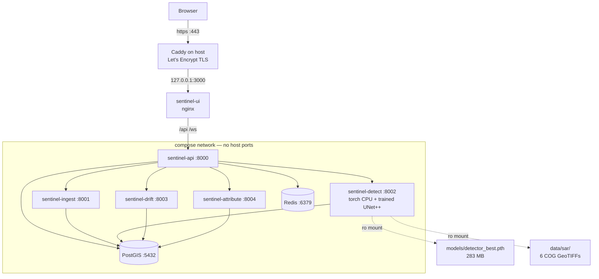

# SENTINEL — Deploying on the AWS Free Plan, inside $100

A single-instance runbook. Written against a real credit balance of **$100**,
a **Free account plan**, and a requirement to stay reachable for **60 days**.

`docs/DEPLOYMENT_AWS.md` is the other document in this folder. It is a sizing
study for a funded team — its cheapest tier is ~$275/month because it assumes
RDS + ElastiCache + ALB + NAT Gateway. **None of that applies here.** On this
budget, a NAT Gateway alone ($35/mo) would eat a third of your credits before
a single container started. This runbook puts everything on one box instead.

---

## 0. The verdict, before you spend anything

**24/7 for 60 days does not fit in $100. It costs about $151.**

That is the arithmetic, not an opinion. The all-in burn rate for the instance
this stack needs is **$0.1051/hour** while running, so 1,440 hours costs
$151.41. Even at the $140 you mentioned, two months of continuous uptime is
$11 short.

**What does fit is a scheduled day.** Run the box ~14 hours a day and two
months costs **$93.95**, leaving ~$6 of margin.

| Uptime per day | Hours run (60 d) | Total cost (60 d) | Verdict |
|---|---|---|---|
| 24 h | 1,440 | **$151.41** | ✗ over budget |
| 18 h | 1,080 | $116.92 | ✗ over budget |
| 16 h | 960 | $105.44 | ✗ just over |
| **15 h** | **900** | **$99.70** | **= exactly $100** |
| **14 h** | **840** | **$93.95** | **✓ recommended** |
| 12 h | 720 | $82.46 | ✓ |
| 8 h | 480 | $59.48 | ✓ lots of margin |

Two months of $100 buys **903 running hours**. Spread over 60 days that is
15.05 h/day. Budget 14 and keep the change.

> **The one thing that makes this safe:** on the **Free account plan** you
> cannot overspend. When the credits run out or the 6-month window closes,
> AWS **suspends the account** — it does not bill your card. Your worst case
> is downtime, not a debt. That property is the entire reason this plan is
> recommended over upgrading to Paid, where the same overshoot becomes a real
> charge. Do not upgrade until you have decided you want to pay.

---

## 1. What your account actually allows

These are hard constraints. They come from the Free Tier rules for accounts
created **on or after 15 July 2025**, which yours is.

### 1.1 Instance types are a closed list

Only six types are eligible on the Free plan:

| Type | vCPU | RAM | On-demand (us-east-1) |
|---|---|---|---|
| `t3.micro` | 2 | 1 GB | — too small |
| `t3.small` | 2 | 2 GB | — too small |
| `t4g.micro` | 2 | 1 GB | — too small (ARM) |
| `t4g.small` | 2 | 2 GB | — too small (ARM) |
| `c7i-flex.large` | 2 | **4 GB** | $0.08479/hr |
| **`m7i-flex.large`** | **2** | **8 GB** | **$0.09576/hr** |

**Deploy `m7i-flex.large`.** Same 2 vCPU as the cheaper `c7i-flex.large`, so
you lose no CPU throughput — you pay 13% more purely for the RAM, and you need
it (see §3).

Confirm the list yourself before launching, so you are not trusting a document:

```bash
aws ec2 describe-instance-types \
  --filters Name=free-tier-eligible,Values=true \
  --query "InstanceTypes[*].[InstanceType]" --output text | sort
```

### 1.2 There is no GPU, and there cannot be

`g4dn`, `g5`, `p3` — none are on that list. On the Free plan you **cannot
launch a GPU instance at all**, and even if you could, a `g5.xlarge` at
~$1.01/hr would consume the entire $100 in **about four days**.

**You do not need one.** Your checkpoint is 24.7 M parameters (283 MB,
resnet34 encoder). It runs on CPU. Slow — a 2048² scene tiled at 512 will take
tens of seconds rather than one — but for a demo that is fine. GPU inference is
simply off the table, and the deployment is designed around that.

### 1.3 The 6-month clock

Credits expire **6 months from the day you created the account**, or when the
balance hits zero, whichever comes first. Check the date now:

> **Console → Billing and Cost Management → Credits**

If your account is already ~4 months old, you have less runway than 60 days and
should plan a shorter window or fewer hours per day. Do not skip this check —
it is the single most likely reason for an unexpected outage.

### 1.4 Region

Use **us-east-1**. `ap-south-1` (Mumbai) is closer to you but runs roughly
10–15% higher, which would push the 14 h/day plan over budget. Recompute
§2 with the local rate if you want the lower latency:

```bash
aws pricing get-products --service-code AmazonEC2 --region us-east-1 \
  --filters "Type=TERM_MATCH,Field=instanceType,Values=m7i-flex.large" 2>/dev/null | head
```

---

## 2. The cost model

Three line items run continuously. Only the first stops when the instance stops.

| Item | Rate | Notes |
|---|---|---|
| EC2 `m7i-flex.large` | $0.09576 /hr | **only while running** |
| EBS gp3, 40 GB | $0.00438 /hr | billed while the volume exists, running or not |
| Elastic IP | $0.00500 /hr | billed while allocated, attached or not |
| Data transfer out | — | first 100 GB/month free; a demo will not approach it |
| CloudFront (optional, §7.3) | ~$0.01/10k req + $0.085/GB | **no fixed monthly fee**; ~$0.40–1.40 over 60 days at demo traffic |

> **CloudFront has no hourly charge** — that is the whole reason it is the right
> front door here. An ALB would be $20/month before a single request, which is
> why §4 does not use one. CloudFront bills per request and per GB, so a
> maintenance page that receives a handful of hits overnight costs effectively
> nothing, while still being available 24/7.

```
running  = 0.09576 + 0.00438 + 0.00500 = $0.105144 /hr
stopped  =           0.00438 + 0.00500 = $0.009384 /hr
```

**Why 40 GB and not the 30 GB you might expect:** the `detect` image with
torch is ~2.5–3 GB on its own, `drift` ~1.5 GB, and the other six services plus
PostGIS total roughly 4 GB. That is ~9–10 GB of images, and the build cache
peaks a few GB above that. On a 30 GB volume the build fills the disk and
fails in a way that looks like a network error. 40 GB costs $3.20/month.

**Why an Elastic IP at all:** a plain public IPv4 is released when the instance
stops and you get a *different address* on the next start — which breaks your
URL twice a day under a scheduled uptime policy. An EIP costs $3.65/month and
keeps the address stable. That is the price of the sleep schedule, and it is
worth it.

### 2.1 The break-even you should remember

> **$100 buys 903 running hours.** That is 15 h/day for 60 days, or 12 h/day
> for 75 days, or 8 h/day for 113 days.

Everything else in this document is in service of spending those hours well.

---

## 3. Sizing: why 8 GB and not 4 GB

`docker-compose.lite.yml` caps its eight services at **~8.4 GB combined** —
already more than an 8 GB instance. Those caps are hard limits, not
reservations, so the box will not actually die, but the profile was sized for
a 16 GB laptop and needs trimming.

`docker-compose.aws.yml` (added alongside this document) retunes it:

| Service | lite cap | aws cap | Why |
|---|---|---|---|
| `db` (PostGIS) | 1 GB | 768 MB | idles ~300 MB |
| `redis` | 256 MB | 192 MB | idle ~20 MB |
| `sentinel-ingest` | 768 MB | 512 MB | — |
| `sentinel-detect` | 3 GB | **2.5 GB** | CPU torch + tiled 2048² inference |
| `sentinel-drift` | 2 GB | 1.4 GB | 64-member ensemble peak |
| `sentinel-attribute` | 512 MB | 448 MB | — |
| `sentinel-api` | 768 MB | 640 MB | — |
| `sentinel-ui` | 128 MB | 96 MB | nginx serving static files |
| **Total** | **~8.4 GB** | **~6.5 GB** | leaves ~1.5 GB for kernel + Docker |

**Why not `c7i-flex.large` (4 GB) to save $0.011/hr:** the trained model plus
the tiled-inference working arrays will not reliably fit alongside PostGIS and
the other six services in 4 GB. You would save ~$9 over two months and spend it
on OOM kills. Take the 8 GB box.

**If you later want to cut RAM further**, the `drift` service is the one to
drop — it is the most fragile component (see §9) and reclaims 1.4 GB.

---

## 4. Architecture

Everything on one instance. Caddy on the host owns 80/443 and terminates TLS;
Docker owns everything else, and **only the UI is published to the host**, on
loopback.



**The security change that matters most.** In `docker-compose.lite.yml` every
service publishes to `0.0.0.0` — Postgres on 5432 with
`POSTGRES_PASSWORD=sentinel_secret`, and Redis on 6379 **with no
authentication at all**. On a laptop that is invisible. On an EC2 box with a
public IPv4 it is an open database and an open cache on the internet. The AWS
compose file removes every `ports:` entry except the UI's, and binds that one
to loopback.

---

## 5. Five blockers to fix before you build

Each of these will cost you an hour if you meet it during the deploy instead of
before it. Four are in the repo today.

### 5.1 `services/ui/.dockerignore` — **fixed, already added**

`services/ui/Dockerfile` runs `npm ci` then `COPY . .`, and there was no
`.dockerignore` anywhere in the repo. So `COPY . .` copied your host's
**891 MB `node_modules/`** over the tree `npm ci` had just installed.

`node_modules` is not portable: esbuild, rollup and friends ship prebuilt
platform binaries. The host copy is `darwin-arm64`, the image is `linux-x64`.
The overwrite fails the build ("you installed esbuild for another platform") or
succeeds and produces a bundle that will not run. It also ships ~900 MB of
build context on every build — over a metered link, to a 2 vCPU instance.

The `.dockerignore` is now in place. **Verify it is picked up** by watching the
"transferring context" line on the first build — it should be a few MB, not
900.

### 5.2 `services/detect/requirements.txt` pulls CUDA torch — **you must patch**

```python
torch==2.3.0
torchvision==0.18.0
```

There is no `--index-url`, so pip resolves against PyPI, and the default
`linux/amd64` wheel for `torch==2.3.0` is the **CUDA 12.1 build**. It drags in
~2.5 GB of `nvidia-*` packages. This instance has no GPU. That is 2.5 GB of
dead weight on a 40 GB disk and several minutes of extra build.

Edit `services/detect/Dockerfile`, replacing the single pip line:

```dockerfile
COPY requirements.txt .

# CPU-only torch, installed FIRST from the PyTorch CPU index. Installing it
# before requirements.txt means the `torch==2.3.0` line below is already
# satisfied (2.3.0+cpu matches ==2.3.0) and pip never fetches the CUDA build.
# This box has no GPU; the CUDA wheel is ~2.5 GB of nvidia-* packages for
# nothing.
RUN pip install --no-cache-dir --index-url https://download.pytorch.org/whl/cpu \
        torch==2.3.0 torchvision==0.18.0 \
 && pip install --no-cache-dir -r requirements.txt
```

If pip still reaches for the CUDA build, delete the `torch`/`torchvision`
lines from `requirements.txt` and keep them only in the Dockerfile.

> This does not affect training on your Mac. The container never had MPS
> access — Docker on Linux has no Metal backend — so pinning CPU changes
> nothing about how the model was trained.

### 5.3 `IN_CHANNELS` default of 6 does not match your checkpoint — **critical**

`services/detect/app/main.py` line 81:

```python
IN_CHANNELS = int(os.getenv("IN_CHANNELS", "6"))
```

Read straight out of your checkpoint's own payload:

```
in_channels = 2
encoder     = resnet34
band_names  = ['VV', 'VH']
best_val_iou= 0.517951
first conv  = torch.Size([64, 2, 7, 7])
params      = 24,738,772
```

The model would be built with 6 input channels, then `load_state_dict` hits a
size mismatch on `encoder.conv1.weight` (`[64,2,7,7]` vs `[64,6,7,7]`).
`strict=False` does **not** save you here — it tolerates missing and unexpected
keys, but a shape mismatch always raises. The container crash-loops.

`ml/training/train_detector.py` line 15 documents this as a fixed bug: *"in_channels
was hardcoded to 6. The archive is 2-band (VV, VH)."* It was fixed in the
**trainer** and never in the **serving** path. `docker-compose.aws.yml` sets
`IN_CHANNELS: "2"` explicitly. Do not remove it.

### 5.4 `MODEL_CHECKPOINT` points at a path that does not exist

```python
MODEL_CHECKPOINT = os.getenv("MODEL_CHECKPOINT", "checkpoints/best_model.pth")
```

But training writes `checkpoints/<run_id>/detector_best.pth` — a different name
in a different place. If the file is not found, `main.py` logs a warning and
falls back to `encoder_weights="imagenet"` — **an untrained decoder**. The
service starts, answers `/health` with 200, and emits nonsense. Silent.

Stage the checkpoint where the compose file expects it:

```bash
cd /Users/praxsmac/projects/claude1/sentinel
mkdir -p models
cp checkpoints/20260915T180945Z-real-10ep-512-holdout-7e9d57/detector_best.pth \
   models/detector_best.pth
ls -lh models/detector_best.pth   # expect ~283M
```

**There is a second, worse version of this failure.** `docker-compose.aws.yml`
mounts `./models` read-only. If that *directory* is absent, Docker does not
complain — it creates an empty one, the mount succeeds, and the container starts
normally with no checkpoint in it. So the fallback above happens with no
warning in the build log at all. `models/README.md` now exists to keep the
directory present and to document what belongs in it; `deploy/preflight.sh`
fails loudly if the file is missing.

`20260915T180945Z-...-holdout-7e9d57` is run C — `best_val_iou 0.517951` on the
leak-free footprint split. It is the best checkpoint you have. **Read §10.1
before you demo it**, because its held-out test score is 0.1447, not 0.5180.

### 5.5 Nothing in `data/` or `checkpoints/` is in git

Confirmed by `git check-ignore`:

```
.gitignore:49:/data/          data/sar, data/index
.gitignore:71:checkpoints/    checkpoints
.gitignore:85:node_modules/   services/ui/node_modules
```

A `git clone` on the server gives you **source only** — no scenes, no model.
You must transfer those separately (§6.3).

---

## 6. Step by step

### 6.0 Before you start

- [ ] Confirmed your plan is **Free account plan**
- [ ] Noted your **credit balance** and **expiry date** (Billing → Credits)
- [ ] AWS CLI configured locally (`aws sts get-caller-identity` works)
- [ ] The §5 fixes are applied — §5.1 is already done for you, §5.2 and §5.3
      you must do, §5.4 is a file copy
- [ ] `bash deploy/preflight.sh` passes on the instance (§6.7). It checks all
      of the above mechanically, so if you only do one thing from this list,
      do that one.

### 6.1 Launch the instance

Console: **EC2 → Launch instance**

| Field | Value |
|---|---|
| Name | `sentinel` |
| AMI | Ubuntu Server 24.04 LTS (x86_64) |
| Instance type | `m7i-flex.large` |
| Key pair | create new, download the `.pem` |
| Network | default VPC, **auto-assign public IP: Enable** |
| Storage | **40 GB gp3** |
| Advanced → Termination protection | **Enable** |

Or via CLI:

```bash
aws ec2 run-instances \
  --image-id resolve:ssm:/aws/service/canonical/ubuntu/server/24.04/stable/current/amd64/hvm/ebs-gp3/ami-id \
  --instance-type m7i-flex.large \
  --key-name sentinel-key \
  --block-device-mappings 'DeviceName=/dev/sda1,Ebs={VolumeSize=40,VolumeType=gp3,DeleteOnTermination=false}' \
  --tag-specifications 'ResourceType=instance,Tags=[{Key=Name,Value=sentinel}]'
```

> `DeleteOnTermination=false` on the volume means terminating the instance does
> **not** destroy your data. That is deliberate — see §12.

### 6.2 Security group

Attach exactly these. Nothing else.

| Port | Source | Why |
|---|---|---|
| 22 | **your IP /32** | SSH. Not `0.0.0.0/0`. |
| 80 | `0.0.0.0/0` | Caddy's Let's Encrypt HTTP-01 challenge |
| 443 | `0.0.0.0/0` | the actual site |

Find your IP: `curl -s https://checkip.amazonaws.com`

**Do not open 5432, 6379, 8000–8004, or 3000.** The compose file does not
publish them, so opening the ports would achieve nothing except exposing a
service the moment someone gets the compose wrong.

### 6.3 Allocate an Elastic IP

```bash
aws ec2 allocate-address --domain vpc
# then associate it with the instance
aws ec2 associate-address --instance-id <INSTANCE_ID> --allocation-id <ALLOC_ID>
export EIP=<the.public.ip>
```

### 6.4 First connection and base hardening

```bash
chmod 400 sentinel-key.pem
ssh -i sentinel-key.pem ubuntu@$EIP
```

On the instance:

```bash
# --- 4 GB swap. Not optional. ---------------------------------------------
# Building the torch image on a 2 vCPU / 8 GB box without swap is how you get
# an OOM kill halfway through a 10-minute build, with a confusing error.
sudo fallocate -l 4G /swapfile
sudo chmod 600 /swapfile
sudo mkswap /swapfile
sudo swapon /swapfile
echo '/swapfile none swap sw 0 0' | sudo tee -a /etc/fstab

# --- Docker --------------------------------------------------------------
sudo apt-get update
sudo apt-get install -y docker.io docker-compose-v2 git rsync
sudo usermod -aG docker ubuntu
newgrp docker

# --- Docker log rotation -------------------------------------------------
# The default json-file driver has NO size cap. Unbounded container logs are
# the classic way a small volume fills up and the box wedges. The compose file
# caps each container too; this is the belt-and-braces default.
sudo tee /etc/docker/daemon.json >/dev/null <<'EOF'
{
  "log-driver": "json-file",
  "log-opts": { "max-size": "10m", "max-file": "3" },
  "live-restore": true
}
EOF
sudo systemctl restart docker

# --- SSH hardening -------------------------------------------------------
sudo sed -i 's/^#\?PasswordAuthentication.*/PasswordAuthentication no/' \
  /etc/ssh/sshd_config
sudo systemctl restart ssh

docker --version && docker compose version
free -h
```

### 6.5 Transfer the code and the runtime assets

From **your Mac**. Source goes over first, minus the 16 GB of things that do
not belong on the server:

```bash
cd /Users/praxsmac/projects/claude1/sentinel

rsync -avz --progress \
  --exclude '.git' \
  --exclude '.venv' \
  --exclude '__pycache__' \
  --exclude 'services/ui/node_modules' \
  --exclude 'services/ui/dist' \
  --exclude 'data/oil_spill_masks' \
  --exclude 'data/synthetic' \
  --exclude 'data/synthetic_legacy_png' \
  --exclude 'data/*.nc' \
  --exclude 'data/*.7z' \
  --exclude 'checkpoints' \
  --exclude 'runs' \
  ./ ubuntu@$EIP:/opt/sentinel/
```

That is roughly 20 MB. Then the two things the demo actually needs — the scenes
and the model:

```bash
rsync -avz --progress data/sar/        ubuntu@$EIP:/opt/sentinel/data/sar/
rsync -avz --progress data/case_files/ ubuntu@$EIP:/opt/sentinel/data/case_files/
rsync -avz --progress data/index/      ubuntu@$EIP:/opt/sentinel/data/index/
rsync -avz --progress models/          ubuntu@$EIP:/opt/sentinel/models/
```

About 470 MB total. **The 7.6 GB of training data stays on your Mac.** Nothing
in the running demo reads `data/oil_spill_masks` or `data/synthetic` — those
exist to train, and you are not training on this box.

> **On this repo having no remote.** Deployment does not need one — the transfer
> above is `rsync` over SSH and never consults GitHub. But that is a deployment
> convenience, not a safety property: **this project currently exists on exactly
> one disk.** The external archive is already gone; if that Mac's drive fails,
> all 64 commits of work go with it, and the SAR scenes in `data/sar/` are not
> reproducible from the brief (see `HANDOVER.md` — the original demo product ID
> does not exist). Push it somewhere private before you spend two months
> deploying it:
>
> ```bash
> # a private GitHub/GitLab remote, or even a bare repo on another machine
> git remote add origin git@github.com:<you>/sentinel.git
> git push -u origin main
> ```
>
> `data/`, `checkpoints/` and `node_modules/` are all gitignored, so the push is
> source only — a few MB, and no scenes, weights or secrets leave the machine.
> The 283 MB checkpoint and the 180 MB of scenes stay a separate, deliberate
> `rsync`. Note also that `.env` is gitignored, so the `SECRET_KEY`,
> `JWT_SECRET` and `DB_PASSWORD` you generate in §6.6 will not be in the push —
> keep them in a password manager, not in the repo.

### 6.6 Configure `.env`

On the server, in `/opt/sentinel`:

```bash
cp .env.example .env
openssl rand -hex 32     # SECRET_KEY
openssl rand -hex 32     # JWT_SECRET
openssl rand -hex 24     # DB_PASSWORD
```

Edit `.env` and set at minimum:

```bash
ENV=production
SENTINEL_ENVIRONMENT=production

SECRET_KEY=<the first random hex>
JWT_SECRET=<the second random hex>
DB_USER=sentinel
DB_PASSWORD=<the third random hex>

# The compose file supplies DB/Redis URLs over the service network, but the
# API reads these too — point them at the compose service names, not localhost.
DATABASE_URL=postgresql+asyncpg://sentinel:<DB_PASSWORD>@db:5432/sentinel
REDIS_URL=redis://redis:6379/0

# Only the address the browser will actually use.
CORS_ORIGINS=https://sentinel.example.com

# ---- The synthetic gates stay OFF. Do not "temporarily" flip these. -------
# An unset or misspelled value must never open a gate; these are fail-closed
# by design (services/ingest/app/provenance.py). Turning one on makes the
# system invent numbers instead of failing loudly.
ALLOW_SYNTHETIC_FORCING=false
ALLOW_SYNTHETIC_AIS=false
SENTINEL_DEMO_MODE=false
ALLOW_SYNTHETIC_TRAINING=false
SENTINEL_DATASOURCES__ALLOW_SYNTHETIC_FALLBACK=false

# The real archive is not on this box. Point the path somewhere harmless so
# nothing tries to stat a missing external disk.
SENTINEL_DATASOURCES__REAL_IMAGES_DIR=/opt/sentinel/data/sar
```

> `DB_PASSWORD` must match between `.env` and the `DATABASE_URL` above, or the
> API starts and every query fails. `docker-compose.aws.yml` builds the DSN
> from `${DB_PASSWORD}`, so setting it in `.env` covers both.

### 6.7 Build

Run the preflight gate first. It checks every blocker in §5 in one pass and
exits non-zero if any of them is unmet:

```bash
cd /opt/sentinel
sudo usermod -aG docker $USER   # if you have not re-logged in since 6.4

bash deploy/preflight.sh
```

It verifies the things that fail *silently* — most importantly that
`models/detector_best.pth` is actually staged and is a real torch archive. A
missing checkpoint does not crash the service; it makes it serve an untrained
decoder at HTTP 200. Fix anything it marks `[FAIL]` before continuing.

Then build:

```bash
# Serial build on purpose. Parallel builds of the torch and drift images on
# 2 vCPU will swap hard and can OOM even with the swapfile.
COMPOSE_PARALLEL_LIMIT=1 docker compose -f docker-compose.aws.yml build 2>&1 | tee /tmp/build.log
```

Expect **20–40 minutes**. Watch the `sentinel-ui` build specifically — the
"transferring context" figure should be single-digit MB. If it says ~900 MB,
the `.dockerignore` did not make it over and you should re-run the rsync.

Once the images exist, re-run the preflight — it can then read `in_channels`
straight out of the checkpoint using the detect image's own torch, which is the
only reliable way to check that field:

```bash
bash deploy/preflight.sh
```

### 6.8 Start

```bash
docker compose -f docker-compose.aws.yml up -d
docker compose -f docker-compose.aws.yml ps
```

Give `sentinel-detect` up to four minutes on first start: torch import plus a
283 MB checkpoint read on 2 vCPU. Then confirm every service is healthy:

```bash
docker compose -f docker-compose.aws.yml ps --format \
  'table {{.Service}}\t{{.Status}}'
```

**Every row must say `(healthy)`.** A service stuck in `starting` past its
`start_period` is the thing to investigate, not to restart and hope.

Check the model actually loaded — this is the assertion that §5.3 and §5.4 were
about:

```bash
docker compose -f docker-compose.aws.yml logs sentinel-detect | grep -i -E 'Loading model|Checkpoint not found|device'
```

You want to see `Loading model from /app/models/detector_best.pth` and
`Using device: cpu`. If you see **`Checkpoint not found ... loading pretrained
encoder only`**, stop — the service will answer requests with an untrained
decoder and produce meaningless output. Fix the mount, do not proceed.

### 6.9 Seed the demo case

```bash
docker compose -f docker-compose.aws.yml exec sentinel-api \
  python scripts/seed_demo_case.py
```

Then verify the API end to end from inside the box:

```bash
curl -s localhost:3000/api/v1/cases | head -c 400
curl -s localhost:3000/health
```

Going through port 3000 (the UI container) rather than 8000 proves the nginx
`/api` proxy works, which is what the browser will actually use.

---

## 7. Public access and TLS

### 7.1 With a domain (recommended)

Caddy gets you a real certificate with no configuration to speak of.

You do **not** need to buy a domain — AWS credits generally do not cover
registration fees (~$10–15/yr). A free DuckDNS subdomain works and Let's
Encrypt will issue against it:

1. Sign in at duckdns.org, create `sentinel-<something>.duckdns.org`
2. Point it at your Elastic IP
3. On the server:

```bash
sudo apt-get install -y debian-keyring debian-archive-keyring apt-transport-https
curl -1sLf 'https://dl.cloudsmith.io/public/caddy/stable/gpg.key' \
  | sudo gpg --dearmor -o /usr/share/keyrings/caddy-stable-archive-keyring.gpg
curl -1sLf 'https://dl.cloudsmith.io/public/caddy/stable/debian.deb.txt' \
  | sudo tee /etc/apt/sources.list.d/caddy-stable.list
sudo apt-get update && sudo apt-get install -y caddy
```

```bash
sudo tee /etc/caddy/Caddyfile >/dev/null <<'EOF'
sentinel-<something>.duckdns.org {
    encode gzip
    reverse_proxy 127.0.0.1:3000
}
EOF
sudo systemctl reload caddy
```

Caddy fetches the certificate on first request. Then set
`CORS_ORIGINS=https://sentinel-<something>.duckdns.org` in `.env` and restart
the API:

```bash
docker compose -f docker-compose.aws.yml up -d sentinel-api
```

### 7.2 Without a domain

Change the UI port binding in `docker-compose.aws.yml`:

```yaml
    ports:
      - "3000:3000"      # was "127.0.0.1:3000:3000"
```

Open port 3000 in the security group, and reach the site at
`http://<EIP>:3000`. Plain HTTP, no certificate.

> Some browser APIs — clipboard, geolocation, service workers — are gated
> behind a secure context and will silently do nothing over plain HTTP. WebGL
> and the deck.gl globe are fine. If a UI feature behaves oddly, check whether
> it needs HTTPS before you debug the code.

### 7.3 Serving a real page while the instance is asleep

**The problem is structural, not cosmetic.** When the instance is stopped,
nothing on that instance can serve anything. The Elastic IP still points at it,
so a visitor gets a connection timeout — the browser's own "can't reach this
site" error, which reads as *broken* rather than *scheduled*. You cannot fix
this from inside the box you just switched off.

So the page has to come from somewhere that is always up. The right AWS
mechanism is **CloudFront with an origin group**: CloudFront sits at the front
permanently, its primary origin is your instance, and its fallback origin is a
static page in S3. When the instance is unreachable, CloudFront fails over and
serves the page instead of an error.

```
                       ┌──────────────────────────────┐
   visitor ──https──►  │  CloudFront distribution     │
                       │  (always on, TLS via ACM)    │
                       └───────────┬──────────────────┘
                                   │  origin group
                     ┌─────────────┴─────────────┐
              primary│                           │fallback
                     ▼                           ▼
        ┌────────────────────────┐   ┌────────────────────────┐
        │ EIP → sentinel-ui:3000 │   │ S3 bucket (static)     │
        │ healthy → the real app │   │ asleep → maintenance   │
        └────────────────────────┘   └────────────────────────┘
```

**Cost.** CloudFront bills per request and per GB with **no hourly or monthly
fee**. At demo traffic the maintenance path costs cents:

| Line | Estimate |
|---|---|
| CloudFront requests (200k over 60 days) | ~$0.20 |
| CloudFront data out (~2 GB) | ~$0.17 |
| S3 storage (one 8 KB HTML file) | ~$0.00 |
| ACM certificate | free |
| **Added cost over 60 days** | **~$0.40** |

That takes the 14 h/day plan from $93.95 to about **$94.35** — still inside the
$100, with ~$5.65 of margin. It is affordable *because* CloudFront has no
fixed fee. This is the same reason §4 refuses an ALB.

#### Build it

**1. The page.** `deploy/maintenance/index.html` is already written. It is a
single self-contained file — no fonts, no CDN, no build step — so it loads in
one request and costs nothing to host. It shows the schedule, a live countdown
to the next 08:00 IST, and a progress bar across the sleep window. It reloads
itself when the window opens.

**2. Put it in S3.**

```bash
BUCKET=sentinel-maintenance-<account>-us-east-1

aws s3 mb s3://$BUCKET --region us-east-1
aws s3 cp deploy/maintenance/index.html s3://$BUCKET/index.html \
  --content-type "text/html; charset=utf-8" --cache-control "max-age=60"

# Static website hosting. Setting the ERROR document to the same file is what
# makes deep links work: with the instance down, any path S3 cannot find
# (/cases/123, /spills) returns the maintenance page instead of a bare 404.
aws s3 website s3://$BUCKET --index-document index.html --error-document index.html
```

The bucket holds one non-sensitive file. Grant public read on it:

```bash
aws s3api delete-public-access-block --bucket $BUCKET
aws s3api put-bucket-policy --bucket $BUCKET --policy "{
  \"Version\":\"2012-10-17\",
  \"Statement\":[{\"Sid\":\"PublicRead\",\"Effect\":\"Allow\",
    \"Principal\":\"*\",\"Action\":\"s3:GetObject\",
    \"Resource\":\"arn:aws:s3:::$BUCKET/*\"}]}"
```

> Be clear about what you just did: that bucket is world-readable. That is
> acceptable **only** because it contains a static notice and nothing else.
> Never point this policy at a bucket holding case files, SAR scenes or
> anything derived from them.

**3. Create the distribution with an origin group.**

In the console: **CloudFront → Create distribution**, then under **Origins**
create two origins and group them.

| Setting | Primary origin | Fallback origin |
|---|---|---|
| Origin domain | `<EIP>` | `$BUCKET.s3-website-us-east-1.amazonaws.com` |
| Protocol | HTTP only | HTTP only |
| HTTP port | 3000 | 80 |
| Origin path | — | — |

Then **Create origin group**: primary = the EC2 origin, fallback = the S3
origin, failover criteria = **500, 502, 503, 504**.

Why this works when the instance is stopped: the connection is *refused*, and
CloudFront treats a connection failure as failover-eligible under those codes.
Set the origin's **connection attempts to 1** and the **origin response
timeout to 10 s** so the failover is quick rather than leaving a visitor
waiting 30 seconds.

Cache behavior: point the default behavior (`*`) at the **origin group**, and
attach the managed **CachingDisabled** policy. You do not want CloudFront
caching your API responses. Add a second behavior for `/assets/*` with
**CachingOptimized** if you want the static bundle cached.

**4. Let CloudFront reach the origin.** Replace the `3000` rule from §6.2 with
the AWS-managed CloudFront prefix list — not `0.0.0.0/0`, which would let
anyone bypass CloudFront and hit the origin directly:

```bash
PL=$(aws ec2 describe-managed-prefix-lists \
  --filters Name=prefix-list-name,Values=com.amazonaws.global.cloudfront.origin-facing \
  --query "PrefixLists[0].PrefixListId" --output text)

aws ec2 authorize-security-group-ingress --group-id <SG_ID> \
  --ip-permissions "IpProtocol=tcp,FromPort=3000,ToPort=3000,PrefixListIds=[{PrefixListId=$PL}]"

# and remove the old open rule
aws ec2 revoke-security-group-ingress --group-id <SG_ID> \
  --protocol tcp --port 3000 --cidr 0.0.0.0/0 2>/dev/null || true
```

**5. You can now drop Caddy.** CloudFront terminates TLS with a free ACM
certificate, so §7.1 becomes optional — bind the UI back to `127.0.0.1:3000`
and let CloudFront be the only front door. Simpler, and one less certificate
renewal to think about. (Caddy is still the right answer if you would rather
not add CloudFront; the two are alternatives, not a sequence.)

#### Verify the failover actually works

Do not assume it. Test it before you rely on it:

```bash
# with the instance running
curl -sI https://<distribution>.cloudfront.net/ | head -1        # expect 200

# stop the instance, wait ~2 minutes, then
aws ec2 stop-instances --instance-ids <INSTANCE_ID>
curl -s https://<distribution>.cloudfront.net/ | grep -o "SENTINEL" | head -1
# expect the maintenance page, NOT a connection error

aws ec2 start-instances --instance-ids <INSTANCE_ID>
```

#### Without CloudFront

If you would rather not add it, the alternatives are:

- **Cloudflare in front (free).** Free DNS and a free Worker that returns the
  maintenance page when the origin is unreachable — 100,000 requests/day on the
  free plan. Genuinely $0 beyond the domain. Requires moving DNS to Cloudflare.
- **Nothing.** Accept that overnight the URL shows a browser connection error,
  and put the schedule in your README and demo notes instead. Honest, free, and
  worse.

**Not recommended: Route 53 failover routing.** It costs a hosted zone
($0.50/mo) *plus* a health check (~$0.75/mo) and still needs CloudFront in
front for HTTPS on the S3 side — strictly more money for the same result.

---

## 8. The sleep schedule — this is where the money is saved

Two EventBridge Scheduler rules. They run outside the instance, so they work
even if the box is wedged or Docker is down.

**Create the IAM role first:**

```bash
aws iam create-role --role-name sentinel-scheduler \
  --assume-role-policy-document '{
    "Version":"2012-10-17",
    "Statement":[{"Effect":"Allow",
      "Principal":{"Service":"scheduler.amazonaws.com"},
      "Action":"sts:AssumeRole"}]}'

aws iam put-role-policy --role-name sentinel-scheduler \
  --policy-name sentinel-ec2-power \
  --policy-document '{
    "Version":"2012-10-17",
    "Statement":[{"Effect":"Allow",
      "Action":["ec2:StartInstances","ec2:StopInstances"],
      "Resource":"arn:aws:ec2:us-east-1:<ACCOUNT_ID>:instance/<INSTANCE_ID>"}]}'
```

**Then the two schedules.** EventBridge cron is **UTC** — IST is UTC+5:30, so
08:00 IST is 02:30 UTC:

```bash
ROLE_ARN=arn:aws:iam::<ACCOUNT_ID>:role/sentinel-scheduler

# Start 08:00 IST  = 02:30 UTC
aws scheduler create-schedule \
  --name sentinel-start \
  --schedule-expression "cron(30 2 * * ? *)" \
  --flexible-time-window 'Mode=OFF' \
  --target "{\"Arn\":\"arn:aws:scheduler:::aws-sdk:ec2:startInstances\",
              \"RoleArn\":\"$ROLE_ARN\",
              \"Input\":\"{\\\"InstanceIds\\\":[\\\"<INSTANCE_ID>\\\"]}\"}"

# Stop 22:00 IST = 16:30 UTC
aws scheduler create-schedule \
  --name sentinel-stop \
  --schedule-expression "cron(30 16 * * ? *)" \
  --flexible-time-window 'Mode=OFF' \
  --target "{\"Arn\":\"arn:aws:scheduler:::aws-sdk:ec2:stopInstances\",
              \"RoleArn\":\"$ROLE_ARN\",
              \"Input\":\"{\\\"InstanceIds\\\":[\\\"<INSTANCE_ID>\\\"]}\"}"
```

That is **14 h/day → $93.95 for 60 days**.

Container restart policy is `unless-stopped`, so the stack comes back on its
own after a start — with one caveat worth knowing: `unless-stopped` means a
container you *manually* stopped stays stopped, but a container stopped by the
instance going down comes back. Since you are stopping the *instance*, not the
containers, everything returns automatically. Verify once, the first morning:

```bash
docker compose -f docker-compose.aws.yml ps
```

**To change the plan**, edit the two schedules. Every hour per day is worth
about **$5.74 over 60 days** at the rates in §2.

### 8.1 Why 14 hours, and when to choose something else

The 14 is not a preference. It is a division:

```
$100 ÷ $0.105144/hr  = 903 running hours
903 h ÷ 60 days      = 15.05 h/day
15.05                → round DOWN to 14, for margin
```

The margin is not padding for its own sake. Three things eat it:

- a day spent rebuilding images after a failed build,
- a night you forget to let the schedule stop the box,
- the CloudFront/S3 pennies from §7.3.

**But the window shape is entirely yours** — every row below costs the same
$100, and the only question is *when* you need the site to be up:

| Schedule | Lasts | Best when |
|---|---|---|
| 24 / 7 | ~39 days | one intense month; a deadline you can date precisely |
| 16 h/day | ~52 days | you need most of the day covered |
| **14 h/day** | **60 days** | **you said two months — this is that** |
| 12 h/day | ~75 days | you mostly need to show it, not to work in it |
| 8 h/day | ~113 days | long-tail availability, demos by appointment |

That table is the honest answer to "why 14": **because you asked for two
months.** If what you actually have is a demo date three weeks out, run it 24/7
and stop pretending you need 60 days of a window you will not use.

**Why 08:00–22:00 specifically.** That span covers Indian working hours plus
the evening, which is when a recruiter, a professor or an evaluator is most
likely to open the link. If your audience sits in another timezone, shift the
window rather than widening it — a 14-hour window placed correctly beats a
20-hour window that is asleep when anyone looks.

**Two things worth knowing before you commit:**

1. **Overshooting suspends the account, it does not bill you.** On the Free
   plan that is a bounded, recoverable failure. But a suspension that lands on
   the morning of a demo is indistinguishable from a disaster, which is why the
   alerts in §9.1 matter more than the margin does.
2. **You can change your mind cheaply.** Both schedules are one cron
   expression; editing them takes a minute and costs nothing. Start at 14 h/day,
   watch the actual burn in Cost Explorer for a week, then move the numbers to
   match reality rather than keeping a plan you guessed at.

---

## 9. Guardrails

### 9.1 Budget alerts — set these before you do anything else

```bash
ACCOUNT_ID=$(aws sts get-caller-identity --query Account --output text)

aws budgets create-budget \
  --account-id "$ACCOUNT_ID" \
  --budget '{
    "BudgetName":"sentinel-credits",
    "BudgetLimit":{"Amount":"100","Unit":"USD"},
    "TimeUnit":"MONTHLY",
    "BudgetType":"COST"}' \
  --notifications-with-subscribers '[
    {"Notification":{"NotificationType":"ACTUAL","ComparisonOperator":"GREATER_THAN","Threshold":50,"ThresholdType":"PERCENTAGE"},
     "Subscribers":[{"SubscriptionType":"EMAIL","Address":"you@example.com"}]},
    {"Notification":{"NotificationType":"ACTUAL","ComparisonOperator":"GREATER_THAN","Threshold":80,"ThresholdType":"PERCENTAGE"},
     "Subscribers":[{"SubscriptionType":"EMAIL","Address":"you@example.com"}]},
    {"Notification":{"NotificationType":"ACTUAL","ComparisonOperator":"GREATER_THAN","Threshold":95,"ThresholdType":"PERCENTAGE"},
     "Subscribers":[{"SubscriptionType":"EMAIL","Address":"you@example.com"}]}]'
```

On the Free plan these are tripwires, not brakes — AWS suspends rather than
bills. But they tell you *when*, so a suspension is a planned event rather than
a surprise the morning of a demo.

### 9.2 Disk alarm

The single most common way a small box dies silently. A full disk takes down
Postgres first, then everything else.

```bash
aws cloudwatch put-metric-alarm \
  --alarm-name sentinel-disk-high \
  --namespace AWS/EC2 \
  --metric-name disk_used_percent \
  --dimensions Name=InstanceId,Value=<INSTANCE_ID> \
  --statistic Average --period 300 --threshold 85 \
  --comparison-operator GreaterThanThreshold --evaluation-periods 2 \
  --alarm-actions <SNS_TOPIC_ARN>
```

(Requires the CloudWatch agent on the instance for `disk_used_percent`. A
cheaper equivalent that needs no agent — a weekly cron that mails you
`df -h` and `docker system df`.)

**Reclaim space when you need it:**

```bash
docker system prune -af --volumes   # DESTRUCTIVE: drops unused images AND volumes
```

Careful: `--volumes` will delete `pgdata` if the stack is down. Prefer
`docker image prune -af` and `docker builder prune -af`, which are safe.

### 9.3 What *not* to do

- **Do not upgrade to the Paid plan** to "just get more headroom". That is the
  change that turns an overshoot from a suspension into an invoice. If you
  decide you want 24/7, do the arithmetic in §2 first.
- **Do not enable termination protection and then forget the volume is
  `DeleteOnTermination=false`.** You will keep paying $3.20/month for a 40 GB
  volume after you think you have cleaned up. See §12.
- **Do not leave the security group open to `0.0.0.0/0` on 22.** A box with a
  public IP gets scanned within minutes.

---

## 10. Verification checklist

Run this after the first successful boot, and again after any change.

```bash
cd /opt/sentinel
DC="docker compose -f docker-compose.aws.yml"

# 1. Every service healthy
$DC ps --format 'table {{.Service}}\t{{.Status}}'

# 2. The trained model loaded, on CPU  ← the §5.3 / §5.4 assertion
$DC logs sentinel-detect | grep -i -E 'Loading model|Checkpoint not found|Using device'
#    expect: "Loading model from /app/models/detector_best.pth" + "Using device: cpu"

# 3. Only ONE port is published to the host
docker ps --format '{{.Names}}\t{{.Ports}}' | grep -c '0.0.0.0'
#    expect: 0   (everything is loopback or internal)

# 4. Postgres is NOT reachable from outside
#    from your Mac:
#    nc -zv $EIP 5432   → must fail/time out
#    nc -zv $EIP 6379   → must fail/time out

# 5. API answers through the UI proxy
curl -s localhost:3000/health
curl -s localhost:3000/api/v1/cases | head -c 300

# 6. Synthetic gates are shut
$DC exec sentinel-api env | grep -E 'ALLOW_SYNTHETIC|DEMO_MODE'
#    every one of them must read false

# 7. Disk headroom
df -h / && docker system df
```

### 10.1 Before you demo the trained model — read this

The checkpoint you are deploying is run C. Its numbers are:

```
val  (leak-free footprint split)   0.5180   ← what you tuned against
test (held-out, 6 acquisitions)    0.1447   ← the number nothing was tuned against
```

And it fails in a specific, diagnosable direction: at that checkpoint the model
was **conservative on val** (precision 0.95) and **aggressive on test**
(precision 0.15, recall 0.76). On unseen acquisitions it emitted **333,079
false-positive pixels against 59,513 true positives** — six wrong pixels for
every right one.

**Your `data/sar/` scenes were not in the training archive.** They are the six
Wakashio COG GeoTIFFs fetched separately from CDSE. So the UNet++ path will be
running on exactly the kind of unseen acquisition where it over-predicts. Do
not be surprised if the segmentation overlay is noisy, and **do not present
0.5180 as the model's accuracy** — the honest figure is 0.1447, on a wide
6-acquisition estimate.

Two ways to handle it, both defensible:

- **Lead with the deterministic detector.** The Tier-A path is verified on real
  data: *10 Aug 2020 real hit, 3.34 km², −9.81 dB, confidence 0.934*. Present
  the UNet++ as "trained end to end, with a held-out number we did not tune
  against, and here is why it is low." That is a stronger story than a good
  number you cannot defend.
- **Run both and show the difference.** The gap between a tuned val score and a
  held-out test score is the actual finding of this project. `HANDOVER.md`
  already says so: *roughly 63% of the first headline was leakage.*

Test it on the server before you demo it:

```bash
$DC exec sentinel-detect python - <<'PY'
import urllib.request, json
# adjust to the detection endpoint your build exposes
print(json.dumps(json.load(urllib.request.urlopen(
    "http://127.0.0.1:8002/health")), indent=2))
PY
```

---

## 11. Day-2 operations

### Back up the database

```bash
$DC exec -T db pg_dump -U sentinel -d sentinel -Fc > /tmp/sentinel-$(date +%F).dump
```

To S3 (optional; a few MB, and within the free allowance):

```bash
aws s3 mb s3://sentinel-backup-<account>-us-east-1
aws s3 cp /tmp/sentinel-$(date +%F).dump s3://sentinel-backup-<account>-us-east-1/
```

Do this before every change. The volume survives a stop, but not a mistake.

### Snapshot the volume before risky changes

```bash
aws ec2 create-snapshot --volume-id <VOL_ID> \
  --description "pre-upgrade $(date +%F)" \
  --tag-specifications 'ResourceType=snapshot,Tags=[{Key=Name,Value=sentinel-pre-upgrade}]'
```

Snapshots are incremental and you pay only for changed blocks — a few cents.
**Delete old ones**; they accrue quietly.

### Update the code

```bash
# from your Mac
rsync -avz --exclude '.git' --exclude 'node_modules' --exclude 'data' \
  ./ ubuntu@$EIP:/opt/sentinel/

# on the server
cd /opt/sentinel
COMPOSE_PARALLEL_LIMIT=1 $DC build
$DC up -d
$DC ps
```

### Logs

```bash
$DC logs -f --tail=100 sentinel-detect
$DC logs --since 1h sentinel-api
```

### Watch the burn

```bash
aws ce get-cost-and-usage \
  --time-period Start=$(date -v-30d +%F),End=$(date +%F) \
  --granularity DAILY --metrics UnblendedCost
```

At $0.1051/hr you are burning about **$1.47 per 14-hour day**. If the daily
figure is materially above that, something is running when it should not be —
check for a second instance, an unattached EIP, or old snapshots.

---

## 12. Teardown — do this properly or you keep paying

Order matters. The EBS volume is `DeleteOnTermination=false`, so terminating
the instance **does not** stop the storage charge.

```bash
$DC down                     # stop containers
aws ec2 terminate-instances --instance-ids <INSTANCE_ID>
aws ec2 release-address --allocation-id <ALLOC_ID>       # stops the $0.005/hr
aws ec2 delete-volume --volume-id <VOL_ID>               # only after a final dump
aws scheduler delete-schedule --name sentinel-start
aws scheduler delete-schedule --name sentinel-stop
aws ec2 describe-volumes --filters Name=status,Values=available   # find strays
aws ec2 describe-addresses                                        # find strays
aws ec2 describe-snapshots --owner-ids self                       # find strays
```

The last three commands are the ones that matter. **Unattached EIPs and orphaned
snapshots are the two charges that outlive a teardown** and quietly drain
whatever credit is left.

---

## 13. Honest limitations of this deployment

Stated rather than buried, in the spirit of the rest of this repo.

1. **Two months at 24/7 is not affordable.** §0. If you need genuine always-on
   uptime, this budget does not support it and no amount of tuning changes
   that — it is a pricing fact.
2. **Inference is CPU-only and slow.** Tens of seconds per 2048² scene. Fine
   for a demo, not for interactive use.
3. **The trained model over-predicts on unseen acquisitions.** §10.1. Its
   held-out test IoU is 0.1447.
4. **`drift` will fail until its Dockerfile is patched.** `cfgrib` needs
   `libeccodes0`, which `services/drift/Dockerfile` does not install — the same
   gap the lite compose header documents. Add `libeccodes0` to the apt line, or
   run drift natively. Without CDS credentials it also fails closed by design,
   which is correct behaviour and not a bug.
5. **`intel` is not deployed**, so case narratives fall back to the
   deterministic template. Ollama would need ~1–2 GB you do not have spare.
6. **Band order is still assumed, not measured.** The checkpoint records
   `band_names = ['VV','VH']`, but per `LIMITATIONS.md` B12 that labelling is
   inferred, not verified. Training is unaffected — both channels are used —
   but any *physical* reading of "VV" in the UI is provisional.
7. **No held-out test set of meaningful width.** 6 acquisitions. The 0.1447
   figure is wide, and it is still the only number nothing was tuned against.
8. **Single instance, no redundancy.** It goes down, the site goes down. There
   is no ALB, no standby, and no failover — those are the $275/month tier's
   features.
9. **Docker images have never been build-verified.** `HANDOVER.md` §3.2 and
   `RUNBOOK.md` §3.3 both say so: no Docker daemon has ever built these. The
   first build on the instance is the real test, and §5.1–§5.4 are the four
   failures already predicted. Budget an hour for the unexpected fifth.
10. **The external SAR archive is not required, and its absence is safe.**
    `data/index/real/manifest.jsonl` records absolute paths into
    `/Volumes/Ventoy/Oil`, so with that disk unmounted the paths dangle. This
    was checked rather than assumed: `resolve_source("real")` raises
    `DataSourceUnavailableError(reason="real_images_missing")` from
    `_list_rasters` — which runs **before** the manifest write path — so the
    index is never rewritten and survives byte-identical. Confirmed empirically:
    **308 tests pass with the disk absent**, the manifest hash is unchanged
    (`dba6c9dd…` before and after), and the only file in `services/` that
    mentions the real manifest at all is a test. What breaks is exactly what
    should break: `--data-source real` training and index rebuilds, both loudly.
    The `source.json` sidecar still carries the full provenance record
    (1200 rows, 195 scenes, `footprint_connected`, train 909 / val 194 /
    test 97), so the dataset definition is documented even with the disk gone.

---

## 14. One-page summary

| | |
|---|---|
| Instance | `m7i-flex.large` — 2 vCPU, 8 GB, Ubuntu 24.04 |
| Storage | 40 GB gp3, `DeleteOnTermination=false` |
| Region | us-east-1 |
| Address | Elastic IP (survives the daily stop/start) |
| Uptime | 08:00–22:00 IST via EventBridge Scheduler = 14 h/day (§8.1) |
| Burn rate | $0.1051/hr running, $0.0094/hr stopped |
| **60-day cost** | **$93.95** — or **~$94.35** with the maintenance page. Leaves ~$5.65 of $100 |
| Profile | `docker-compose.aws.yml` — 8 services, only the UI published, on loopback |
| TLS | Caddy on the host (§7.1), or CloudFront (§7.3) |
| Overnight | CloudFront origin-group failover → S3 maintenance page (§7.3) |
| Model | run C, `best_val_iou 0.517951`, `IN_CHANNELS=2`, CPU |
| Worst case | account suspension — **not a bill**, on the Free plan |
| Fix first | §5.2 CUDA torch · §5.3 `IN_CHANNELS` · §5.4 checkpoint path |
| Not needed | the external SAR archive — see §13.10 |
